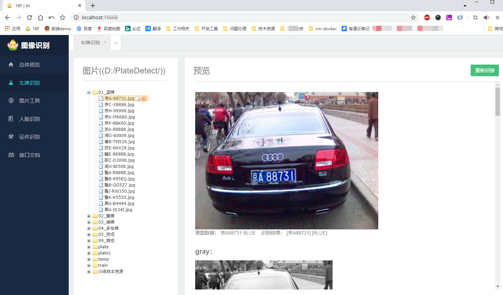
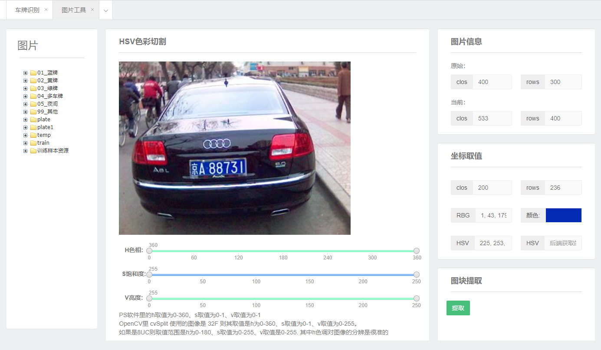
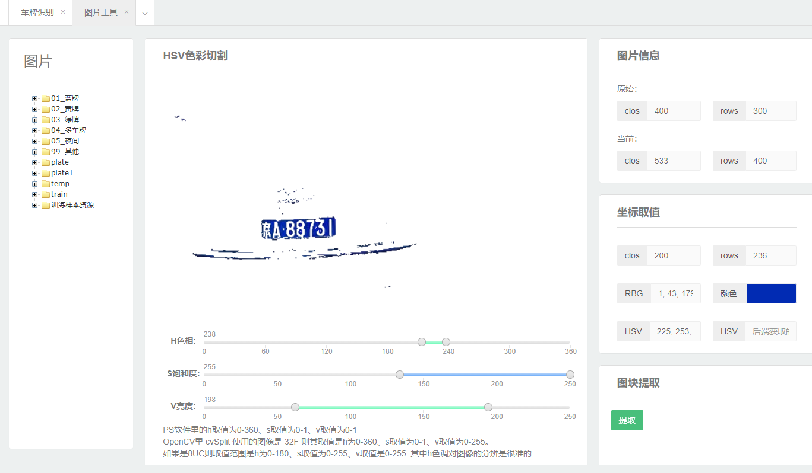
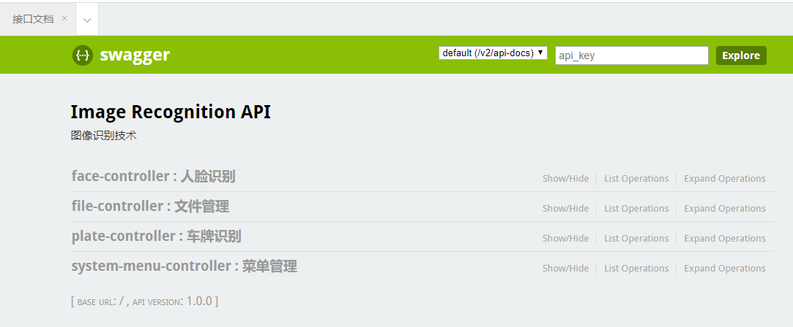

# yx-image-recognition

#### 介绍
- **spring boot + maven + opencv 实现的图像识别及训练Demo**
- 基于java语言的深度学习项目，在整个开源社区来说都相对较少；拥有完整的训练过程、检测、识别过程的项目代码更是少之又少
- **本人参考了EasyPR原版C++项目、以及fan-wenjie的EasyPR-Java项目；同时查阅了部分opencv官方4.0.1版本C++的源码，结合个人对java语言理解，整理出当前项目**
- 这是一个**入门级教程项目**，本人目前也正在学习图片识别相关技术；大牛请绕路
- 获取更多资源和帮助，QQ群号：1054836232

#### 包含功能
- ** **$\color{yellow}{黄}$** **$\color{blue}{蓝}$** **$\color{green}{绿}$**** **黄蓝绿车牌检测及车牌号码识别**
- 单张图片、多张图片并发、单图片多车牌检测及识别
- **基于svm算法的车牌检测训练**
- **基于ann算法的车牌号码识别训练**
- **人脸检测**  接下来将实现人脸识别
- 图片处理工具，目前实现了HSV色彩切割，后续将添加更多使用的图片处理工具，用于辅助算法优化

#### 操作界面

#### 软件版本
- jdk 1.8.61+
- maven 3.0+
- opencv 4.0.1 ； javacpp1.4.4；opencv-platform 4.0.1-1.4.4
- spring boot 2.1.5.RELEASE
- yx-image-recognition 1.0.0版本

#### 软件架构
- B/S 架构，前端html + requireJS，后端java
- 数据库使用 sqlite3.0
- 接口文档使用swagger 2.0

#### 相关文档
- [01_开发环境搭建.md](./doc/01_开发环境搭建.md)
- [02_SVM训练说明文档.md -待补齐](./doc/02_SVM训练说明文档.md)
- [03_ANN训练说明文档.md -待补齐](./doc/03_ANN训练说明文档.md)
- [04_车牌识别过程说明文档.md -待补齐](./doc/04_车牌识别过程说明文档.md)
- [05_相关问题解答.md](./doc/05_相关问题解答.md)

#### 使用说明

- **车牌图片来源于网络，仅用于交流学习，不得用于商业用途；如有侵权，请联系本人删除**
- 转发请注明出处； 本项目作者：yuxue，一个不资深的java语言从业者
- 作者gitee地址: https://gitee.com/admin_yu
- 作者csdn微博地址：https://blog.csdn.net/weixin_42686388

#### 参考文档

- liuruoze/EasyPR：https://gitee.com/easypr/EasyPR?_from=gitee_search
- fan-wenjie/EasyPR-Java： https://github.com/fan-wenjie/EasyPR-Java
- opencv官方： https://opencv.org/

